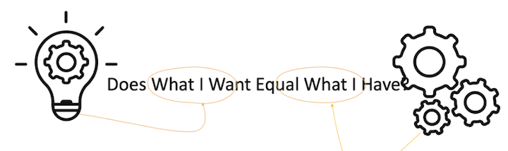
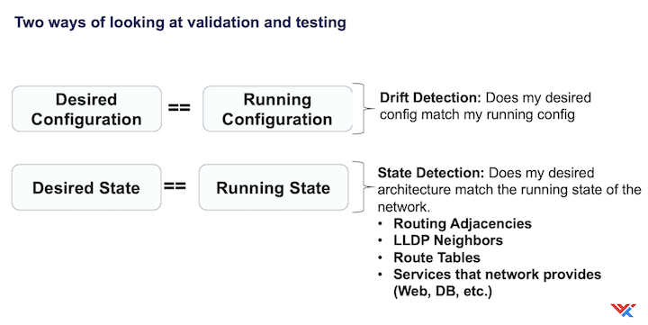

# arista-network-tests

This repository was developed in conjunction with [Ansiblefest2024](https://github.com/boblongmore/ansiblefest2024), which was developed to showcase Ansible and EDA at Red Hat Summit 2024.

## anatomy of a test

## Two Types of Tests

In this scenario, information about configuration and desired architecture are stored in Netbox.

## Configuration Tests

- test_interfaces - are the interfaces configured as Netbox prescribes
- test_system_status - Is there enough free space to upgrade
- test_sw_version - Is the device running the correct version of code

## System Tests

- test_routing - are the BGP neighbors modeled in netbox up and exchanging routes
- test_http - is an http service available through the network topology

# Authors

- Bob Longmore bob.longmore@wwt.com
